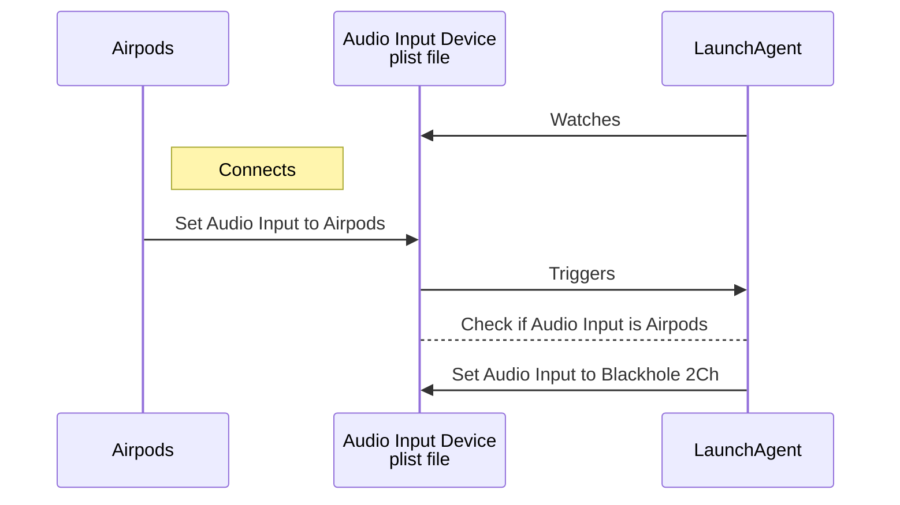

# What
Automation to snatch (back) Audio Input away from Airpods when it is connected.  
This is to prevent the Airpods mic from being used, which severely worsens the audio playback quality.  
Also I have my own mic, stop trying to steal it everytime smh

Detection is done via LaunchAgent `WatchPaths` on a plist file that gets updated when Audio Input changes.  
This file is `/Library/Preferences/Audio/com.apple.audio.SystemSettings.plist`.

Snatching is done via [`deweller/switchaudio-osx`][1].  
It assumes [`ExistentialAudio/BlackHole`][2] is installed as the device to switch to.

## Graph


## Setup
```sh
# This provides a binary that helps with switching audio input
brew install switchaudio-osx

# This provides an audio input device
# We don't actually care about its features; we just need it as a device to switch to
brew install blackhole-2ch
```

## Usage
```sh
# Load and enable the plist
make load

# Unload and disable the plist
make unload
```

## Notes
**Why set the audio input device 50x every 100ms?**  
1\. LaunchAgent has invocation limit of once every 10s.  
2\. The plist file actually gets updated multiple times: on Airpods being connected, and once more when audio devices are switched.  
This means `SwitchAudioSource` may get executed _before_ Airpods is set as the Audio Input, delaying the switch away from Airpods by up to 10 seconds.  
The 50x attempt every 100ms reduces this delay.

**Why check if current input device is Airpods?**  
Without this, it is impossible to set the audio input device to anything other than Blackhole 2Ch.

**I named my airpods something else**  
Update it on [`com.user.disable-airpods-mic.plist#L20`][3].

**I want it to switch to my mic instead of Blackhole 2Ch**  
Update it on [`com.user.disable-airpods-mic.plist#L21`][4].


[1]: https://github.com/deweller/switchaudio-osx
[2]: https://github.com/ExistentialAudio/BlackHole
[3]: https://github.com/FabulousCupcake/disable-airpods-mic/blob/master/com.user.disable-airpods-mic.plist#L20
[4]: https://github.com/FabulousCupcake/disable-airpods-mic/blob/master/com.user.disable-airpods-mic.plist#L21